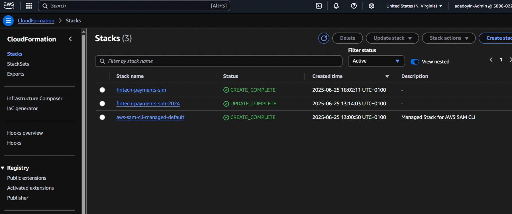
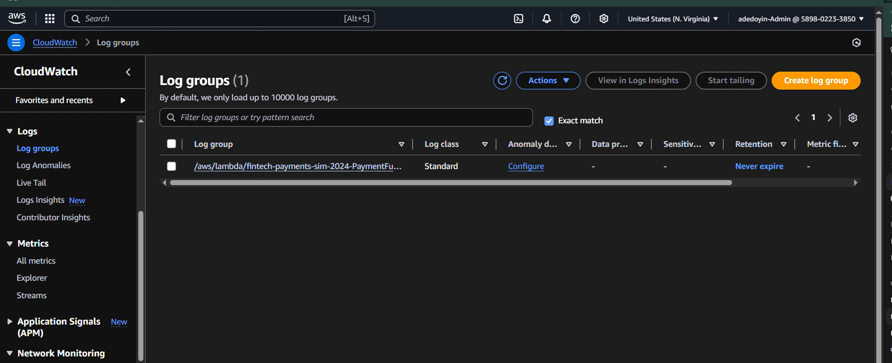
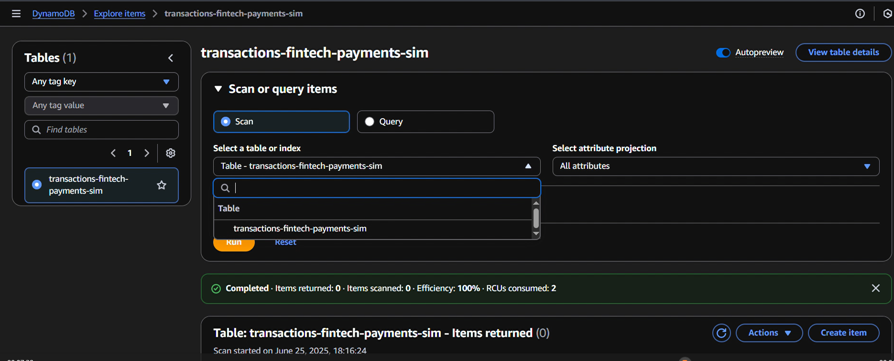
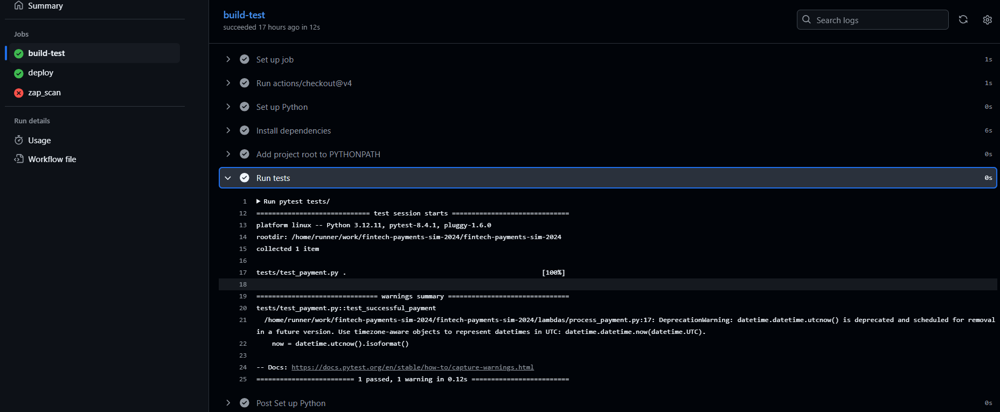
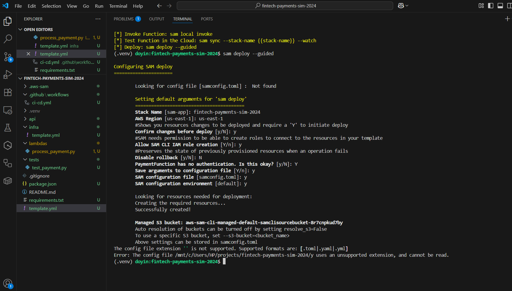

# 💸 fintech-payments-sim-2024 – *AWS Serverless, CI/CD, Security, Real-World DevOps*

## About This Project

This project includes a complete video walkthrough.  
👉 [Watch the demo on YouTube!](https://www.youtube.com/@doyinekong/playlists)

> **A true-to-life fintech payments API, fully serverless on AWS, built and shipped with CI/CD, real infrastructure-as-code, and shift-left security.
> This isn’t a demo. It’s the actual automation and reliability you’d expect from a cloud-native, production-grade system.**

---

##  Table of Contents

- [ Why I Built This & Why It Matters](#-why-i-built-this--why-it-matters)
- [ Project Highlights](#️-project-highlights)
- [ Architecture](#️-architecture)
- [ Screenshots & Walkthrough](#-screenshots--walkthrough)
  - [1. CI/CD Pipeline Overview](#1-cicd-pipeline-overview)
  - [2. CloudFormation Events](#2-cloudformation-events)
  - [3. CloudFormation Stacks](#3-cloudformation-stacks)
  - [4. CloudWatch Logging](#4-cloudwatch-logging)
  - [5. Successful Deploy in CI/CD](#5-successful-deploy-in-cicd)
  - [6. DynamoDB Table](#6-dynamodb-table)
  - [7. Lambda UI](#7-lambda-ui)
  - [8. API Gateway Resource](#8-api-gateway-resource)
  - [9. API Gateway Stages](#9-api-gateway-stages)
  - [10. Build & Test Passing](#10-build--test-passing)
  - [11. SAM Build (Terminal Output)](#11-sam-build-terminal-output)
  - [12. SAM Build (Step View)](#12-sam-build-step-view)
  - [13. SAM Deploy (Guided)](#13-sam-deploy-guided)
  - [14. Successful Transaction Output](#14-successful-transaction-output)
  - [15. DynamoDB: Transaction Persisted](#15-dynamodb-transaction-persisted)
  - [16. OWASP ZAP Security Scan](#16-owasp-zap-security-scan)
  - [17. Production API Output](#17-production-api-output)
  - [18. S3 Bucket: Deployed Templates](#18-s3-bucket-deployed-templates)
  - [19. S3 Bucket: Artifact List](#19-s3-bucket-artifact-list)
- [ Troubleshooting & Lessons Learned](#-troubleshooting--lessons-learned)
- [ How to Run This Project](#️-how-to-run-this-project)
- [ Connect](#-connect)
- [ Keywords](#-keywords)
---

##  Why I Built This & Why It Matters

I wanted to prove (to myself, to recruiters, to future teams) that I can own every part of the DevOps lifecycle—**not just code, but automation, security, troubleshooting, and real AWS infrastructure**.

This project simulates what a modern fintech system actually needs:

- *Everything in code* (no console clicking)
- *Real CI/CD, real monitoring*
- *Failures documented, not hidden*
- *Security and audit baked in, not bolted on*

**For recruiters:** This repo is proof I can ship, automate, secure, and support serious cloud software.

---

##  Project Highlights

- **100% AWS Serverless** – Lambda, API Gateway, DynamoDB, S3, CloudFormation/SAM.
- **Push = Deploy** – GitHub Actions pipeline runs tests, deploys, and security scans automatically.
- **Security Baked In** – OWASP ZAP scan on every deploy (see screenshots—403 is a feature, not a bug).
- **Infra as Code** – All infra is reproducible and versioned.
- **Troubleshooting Shown** – Real AWS issues and errors included; you see what actually happens in production.

---

##  Architecture

**Lambda (Python) ↔️ API Gateway ↔️ DynamoDB**  
*All automated via SAM. Artifacts in S3. Monitoring with CloudWatch. Security in the CI/CD.*

---

##  Screenshots & Walkthrough

Every screenshot is shown in order (1–19) below, with clear explanations.  
Images are referenced as `IMAGES/FILENAME.png`—just copy your images into the `IMAGES/` folder in your repo.

---

### 1. CI/CD Pipeline Overview
  
*Shows the whole GitHub Actions workflow with build-test, deploy, and security scan.*

---

### 2. CloudFormation Events
  
*Proof of all AWS resource creations and status events.*

---

### 3. CloudFormation Stacks
  
*All deployed stacks visible and trackable.*

---

### 4. CloudWatch Logging
  
*Lambda logs are visible and searchable in CloudWatch for observability and debugging.*

---

### 5. Successful Deploy in CI/CD
  
*Deployment job completes; you see API endpoint outputs and stack info.*

---

### 6. DynamoDB Table
  
*Table structure and status as provisioned for transactions.*

---

### 7. Lambda UI
  
*Lambda payment handler function, as deployed in AWS.*

---

### 8. API Gateway Resource
  
*API resource and endpoint for payments.*

---

### 9. API Gateway Stages
  
*Stage-level deployment, with live invoke URL.*

---

### 10. Build & Test Passing
  
*Green check = tests pass before any deploy.*

---

### 11. SAM Build (Terminal Output)
  
*`sam build` shows Lambda and template packaged, ready to ship.*

---

### 12. SAM Build (Step View)
  
*Full build process with all resources and layers bundled.*

---

### 13. SAM Deploy (Guided)
  
*Deploy parameters chosen step-by-step for reproducibility.*

---

### 14. Successful Transaction Output
  
*API call returns status and a unique transaction_id.*

---

### 15. DynamoDB: Transaction Persisted
  
*You can see your API call resulted in a real DB write.*

---

### 16. OWASP ZAP Security Scan
  
*Security scan as part of CI/CD.  
403 error? That’s good—it means your API isn’t wide open to the world (API key required).*

---

### 17. Production API Output
  
*Shows real output (or error) from the deployed API in production.*

---

### 18. S3 Bucket: Deployed Templates
  
*SAM CLI manages all deployment artifacts for rollback, audit, and reproducibility.*

---

### 19. S3 Bucket: Artifact List
  
*Versioned artifacts in S3, fully managed by AWS SAM.*

---

## 💡 Troubleshooting & Lessons Learned

- **Stack in ROLLBACK_COMPLETE:** Delete before redeploy or change the stack name in `sam deploy`.
- **Table Already Exists:** Use unique names or dynamic table names in your infra.
- **ZAP Scan 403:** Endpoint is secured (API key required). This is what you want for fintech APIs.
- **No Changes to Deploy:** All up to date. Edit the template or code to trigger a redeploy.

---

## 🏃‍♂️ How to Run This Project

1. **Clone repo, set AWS credentials.**
2. **Install Python, AWS CLI, AWS SAM CLI.**
3. **Run `sam build` and `sam deploy --guided`.**
4. **(Or) Use GitHub Actions for automated pipeline.**
5. **Run `pytest` for unit tests.**
6. **Check AWS for live API, Lambda, DynamoDB, S3, and logs.**

---

## 🤝 Connect

- [LinkedIn](https://www.linkedin.com/in/adedoyin-ekong/)
- [GitHub](https://github.com/doyindevops)

---

## 🏷️ Keywords

`#AWS #Serverless #DevOps #CI/CD #Fintech #Lambda #DynamoDB #APIGateway #SAM #OWASPZAP #Automation`

---

> ## This project is my proof:
> ## I don’t just write scripts—I deliver production automation, security, and results!!.🔥
